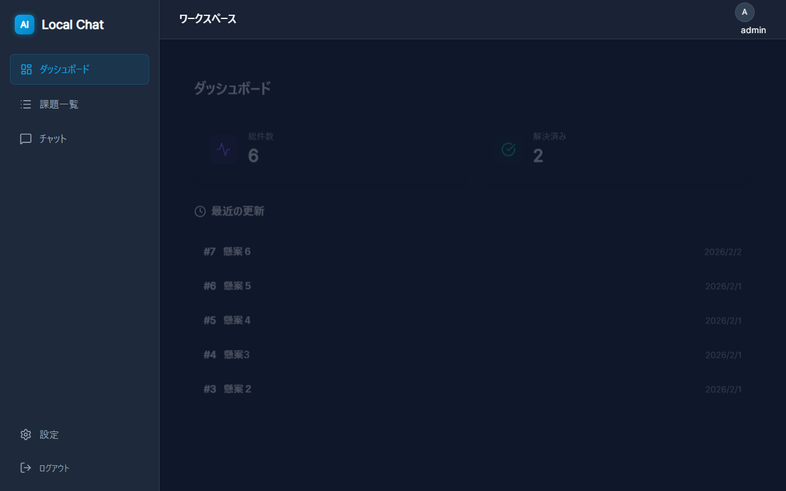
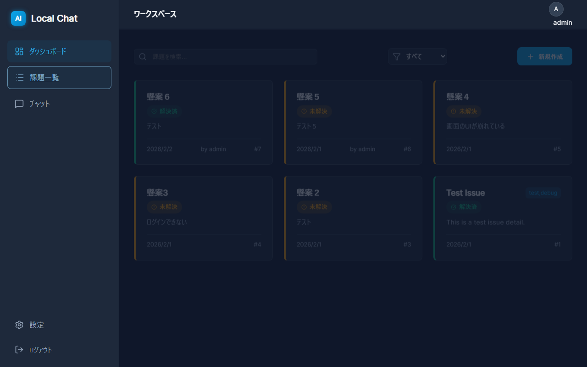
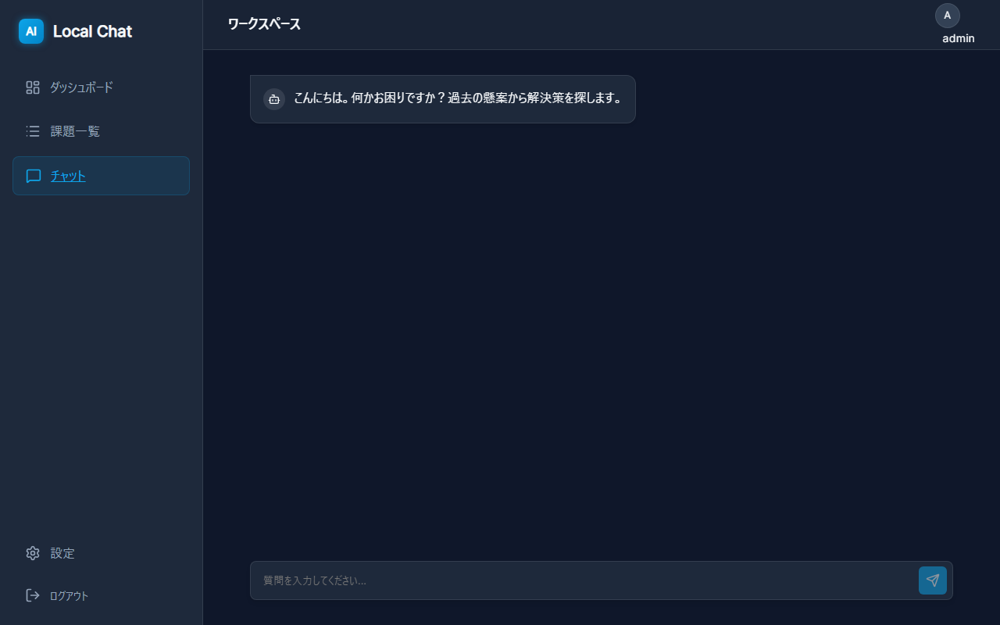

# Local AI Chat & Issue Tracker

ローカル環境で動作するLLM（大規模言語モデル）を活用した、セキュリティ重視の社内向け課題管理・チャット支援ツールです。
「社外にデータを漏らさずにAIを活用したい」というニーズに応えるため、Ollamaを用いてローカルLLM（Qwen2.5等）と連携し、登録された課題データに基づいた回答を生成するRAG（Retrieval-Augmented Generation）機能を実装しています。



## 📸 スクリーンショット

### 課題一覧画面


### AIチャット画面


## 🚀 主な機能

### 1. AIチャットアシスタント (RAG搭載)
*   **文脈理解**: ユーザーの質問から重要なキーワードをAIが自動抽出し、データベース内の過去の課題（Issue）を検索。
*   **回答生成**: 検索でヒットした関連課題と現在のシステム統計（解決数など）をプロンプトに組み込み、ローカルLLMが的確に回答します。
*   **コンテキスト保護**: 外部サーバーへデータを送信せず、全てローカルネットワーク内で完結します。

### 2. 課題管理 (Issue Tracking)
*   **CRUD機能**: 課題の作成、閲覧、編集、削除。
*   **ステータス管理**: 解決策（Resolution）の入力有無で「解決済み/未解決」を自動判定し、視覚的にバッジ表示。
*   **検索・絞り込み**: キーワード検索およびステータスによるフィルタリング機能。
*   **作成者追跡**: どのユーザーが課題を作成したかを記録・表示。

### 3. ユーザー認証
*   **セキュアな認証**: JWT (JSON Web Token) を用いたステートレス認証。
*   **パスワード保護**: Argon2アルゴリズムによる堅牢なハッシュ化保存。

### 4. ダッシュボード
*   システム全体の統計（総件数、解決済み件数）を一目で確認可能。
*   最近更新された課題のリストアップ。

---

## 🛠 技術スタック

### Frontend
*   **Framework**: React (Vite)
*   **Routing**: React Router Dom v6
*   **State Management**: React Context API (Auth)
*   **Styling**: Vanilla CSS (CSS Variables, Flexbox/Grid) - モダンでダークモード基調のUI設計
*   **Icons**: Lucide React

### Backend
*   **Framework**: FastAPI (Python)
*   **Database**: SQLite (SQLAlchemy ORM)
*   **Authentication**: Python-jose (JWT), Passlib (Argon2)
*   **LLM Integration**: OpenAI Client Library (接続先をOllamaに向けることで対応)

### AI / Infrastructure
*   **Local LLM**: Ollama (Running `qwen2.5:3b` or `mistral`)
*   **Environment**: Windows / Localhost

---

## 📂 プロジェクト構成

```
AIChatTool/
├── backend/                # Python FastAPI Backend
│   ├── routers/            # API Endpoints (auth, chat, issues, etc.)
│   ├── app.py              # Application Entry Point
│   ├── crud.py             # Database Operations
│   ├── models.py           # SQLAlchemy Models
│   ├── schemas.py          # Pydantic Schemas
│   └── database.py         # DB Connection
├── frontend/               # React Frontend
│   ├── src/
│   │   ├── components/     # Reusable Components (AppShell, etc.)
│   │   ├── context/        # Global State (AuthContext)
│   │   ├── pages/          # Page Views (Dashboard, IssueList, Chat, etc.)
│   │   └── styles/         # Global Styles
│   └── vite.config.js
└── README.md
```

---

## 🔧 セットアップ手順

### 前提条件
*   Node.js (v18以上)
*   Python (3.10以上)
*   [Ollama](https://ollama.com/) がインストールされ、モデル（例: `qwen2.5:3b`）がpullされていること。

### 1. バックエンドの起動

```bash
cd backend
python -m venv venv
# Windows
.\venv\Scripts\activate
# Mac/Linux
# source venv/bin/activate

pip install -r requirements.txt
# 初回起動（DB作成など）
python -m backend.app
```
※ `.env` ファイルにて `LLM_MODEL` や `SECRET_KEY` を設定してください。

### 2. フロントエンドの起動

```bash
cd frontend
npm install
npm run dev
```

ブラウザで `http://localhost:5173` にアクセスしてください。

### 3. 簡単起動（Windows）

以下のバッチファイルを作成しましたので、ダブルクリックで簡単に起動できます。

*   **初回セットアップ**: `setup.bat` を実行（依存関係のインストールなどを行います）
*   **アプリ起動**: `start.bat` を実行（バックエンド・フロントエンドを起動し、ブラウザを開きます）


---

## 💡 こだわりポイント（ポートフォリオとしての見どころ）

1.  **「ローカル完結」への挑戦**
    *   近年のセキュリティトレンドを意識し、外部API（OpenAI等）に依存せず、Ollamaを用いたローカルLLM構築を行いました。これにより、機密情報を保持したままAI活用が可能になります。

2.  **RAG（検索拡張生成）の実装**
    *   単なるチャットボットではなく、`backend/routers/chat.py` にて「ユーザーの質問からキーワード抽出」→「DB検索」→「プロンプトへのコンテキスト注入」というRAGのパイプラインを実装しています。

3.  **モダンで直感的なUI/UX**
    *   CSSフレームワークに頼りすぎず、CSS変数（Custom Properties）を活用して一貫性のあるデザインシステムを構築しました。
    *   Glassmorphism（すりガラス効果）やスムーズなトランジションを取り入れ、使っていて心地よいアプリケーションを目指しました。

4.  **実用的な機能設計**
    *   「解決/未解決」の自動判定ロジックや、認証による保護など、実際の業務利用を想定した設計を行っています。
